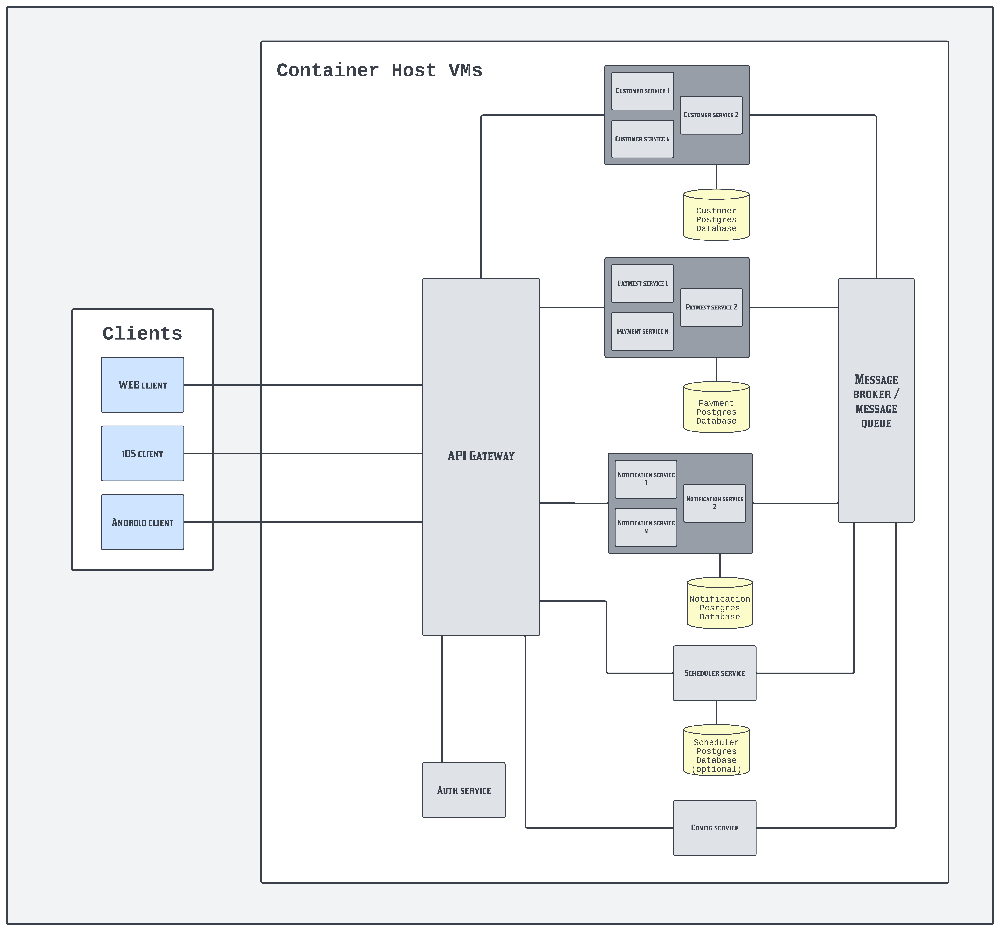

# Documentation

---

## How to run and use
- Run `docker-compose -f docker-compose.yml up -d` in the root directory of the project. This will set up all necessary services: Postgres db, Zookeeper, Kafka, Spring app.
  - Please keep in mind that despite I configured dependency containers for each container, there can still be connection errors between them when setting up the app. In that case, a simple manual restart of the created container should solve the issue.
- Also, versioned database scripts found in `resources/db/migration/` will be run against Postgres db to create the entities used in the processes during the setup process.
- After that, on http://localhost:8080/swagger-ui/index.html# (port is 8081 if you run the app locally outside of docker), you can call the payment transfer endpoint manually for testing.
- For testing via swagger calls, you can use the data of the dummy entities inserted in: `resources/db/migration/V3__bank_account_dummy_dml.sql`
- If you want to receive email notification about the result of the money transfer:
  - Upload your mail receiver email address to the receiver bank_account.owner_email in the database.
  - Fill in the following sender gmail credentials in `resources/application.yml` (please keep in mind for this to work, you need to enable specific related settings in your gmail account):
    - `spring.mail.username` - your gmail address
    - `spring.mail.password` - your gmail password

---

## For this project
- I used **Spring Boot** with **Maven** and **Java 21**.
- Did not implement a UI, but added **Swagger docs** to easily call the API for manual testing.
- **Containerized** the separate services of the app using **Docker**.

---

## Focus Areas

### High Availability
- The application is **containerized**, allowing it to be **scaled** based on user request volume.
- The process was broken down into **asynchronous sub-processes**, enabling the system to handle different parts **independently**.

### Transactional Processing
- Ensured **ACID** compliance by persisting entities **in one transaction** at the end of each process.

### Error Handling
- Implemented **ControllerAdvice** to **handle API errors consistently**.
- Differentiated between:
  - **Retryable errors** (temporary issues that can be retried - current config is set to max 3 tries with 3s delay between each of them).
  - **Non-retryable errors** (errors that should move messages to a **dead letter topic** instead of retrying).

---

## Implementation Extras

### Fault Tolerance
- Introduced **retryable exceptions** to handle temporary failures (e.g., database connection issues), ensuring users don’t have to **manually restart** failed processes.
- Messages that could not be handled by the consumer after a given number of retries are moved to a dead letter topic where they are handled accordingly.

### Documentation
- Documented the **REST API** using **Swagger**.

### Tests
- **I had no time for this part**, but the planned approach:
  - **Unit Testing**: Test each component separately with **mocked dependencies**.
  - **Integration Testing**:
    - Send REST API calls to verify responses for different inputs.
  - **Consumer Testing**:
    - Publish an event from a test class to a topic.
    - After a short delay, check the **test database** to verify that the related record has the correct status.

---

## Full Solution Plan
- The below parts from this point are included to demonstrate what the complete solution would look like to this problem.

## Full Solution with Diagram and High-level Description

### Customer Service
- Includes customer-related functions, e.g., in our app, when sending money through the payment service, we check if the sender and receiver exist through this service via a server-scoped REST API.
- There can be multiple instances running.
- It has a dedicated PostgreSQL database instance to store customer name, phone number, etc.

### Payment Service
- Includes payment-related functions, e.g., in our app, the transfer money functionality.
- There can be multiple instances running.
- It has a dedicated PostgreSQL database instance to store transaction history, etc.

### Notification Service
- Includes notification-related functions, e.g., in our app, sending notifications about successful money transfers.
- This service contains generic notification mechanisms, like sending an email, and allows parameters to assemble and send concrete emails.
- There can be multiple instances running.
- It has a dedicated PostgreSQL database instance to store sent-out notifications, etc.

### Scheduler Service
- Runs scheduled jobs at given times.
- Example: In our app, we could periodically fix issues related to money transfer, such as detecting stuck `PENDING` transactions and setting them to `FAILED` or retrying them.
- This approach enhances fault tolerance, especially when combined with Kafka’s mechanisms to replay failed events.
- Only one instance runs to prevent duplicate job executions.
- It **can** have a dedicated PostgreSQL database for storing advanced schedule settings, though configuration files may suffice for simple schedules.

### API Gateway
- Acts as the entry point for clients.
- Handles rate limiting, load balancing, etc.
- Should handle **authentication/authorization** before allowing communication with other services.

### Auth Service
- Manages **authentication and authorization** of users.
- Handles emission and validation of tokens.

### Config Service
- Provides configurations for service instances and allows runtime updates.
- Only one instance runs to manage configuration centrally.
- Plan: It will read config changes from a separate repo (e.g., GitHub).
- A CI/CD pipeline will trigger a config refresh event when the master branch is updated.
- Running microservice instances will fetch updated configurations during runtime.

### Message Broker / Message Queue
- In our app, we use **Apache Kafka** as the message broker.
- Enables **async event-driven** processes.
- Example: After a successful money transfer, the payment service publishes an event to a Kafka topic.
- The notification service, consuming this topic, sends a notification to the user.

### Logging and monitoring
- Not included on the diagram, but these are important parts as well.